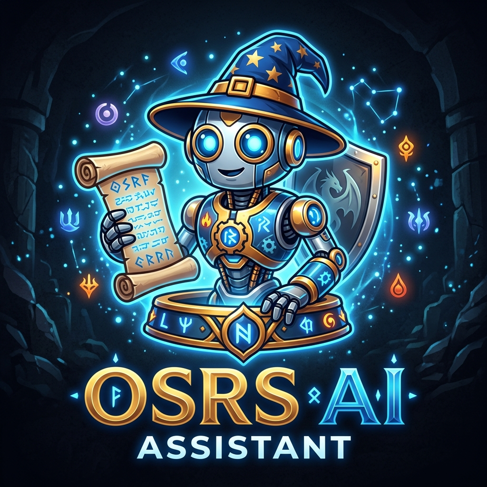

<p align="center">
  
</p>

<h1 align="center">OSRS AI Assistant</h1>

<p align="center">
  <strong>An intelligent, context-aware chatbot plugin for RuneLite</strong>
</p>

<p align="center">
  
  
  
  
</p>

---

**OSRS AI Assistant** is a RuneLite plugin that brings advanced large language models directly into your Old School RuneScape client. It’s designed to act as an in-game companion that understands your gameplay context and helps with progression, skilling, PvM, quests, and strategy.

> [!NOTE]
> Queries can be supplemented with OSRS Wiki context to improve response quality and keep answers aligned with current game knowledge.

---

## ✨ Features

- **🎮 Real-Time Game Context:**
  - Uses relevant player context such as combat and skill levels, run energy, location/region info, and active activities.
  - Can include equipment/inventory/bank-related context when appropriate.
- **🧠 Multi-Model Integration:**
  - **Google Gemini 2.5 Flash** (default)
  - **OpenAI GPT-4o**
  - **Anthropic Claude**
  - **xAI Grok**
- **🗂️ Session & History Management:**
  - Multiple chat sessions
  - Persistent history storage
  - Quick reset/delete flows
- **🖥️ Flexible UI:**
  - RuneLite sidebar panel
  - Detachable chat window
  - Remembers window size/position preferences
- **📚 OSRS Wiki Augmentation:**
  - Pulls relevant wiki snippets into prompt context when useful
- **🔔 Response Notifications:**
  - Optional in-client/OS notifications when responses complete

---

## 🛠️ Configuration

Open **RuneLite Settings (wrench icon)**, search for **OSRS AI Assistant**, then configure:

| Section | Setting | Description |
| :--- | :--- | :--- |
| **API Settings** | **AI Provider** | Choose Gemini, OpenAI, Claude, or Grok. |
| **API Settings** | **API Key** | Your API key for the selected provider. |
| **API Settings** | **Org ID** | Optional organization/client ID (provider-specific). |
| **Data Sharing** | **Share Character Info** | Toggle sending character/game context to the model. |
| **Data Sharing** | **Notify on Response** | Toggle notification behavior when a reply is ready. |

---

## 🚀 Installation

### For Players

Installation is supported via the **RuneLite Plugin Hub** only.

- **Plugin Hub listing: TBA**
---

## 🧪 Development

If you’re contributing or running locally for development:

1. Clone this repository:
   ```bash
   git clone https://github.com/Timboy67678/osrs-ai-assistant.git
   cd osrs-ai-assistant
   ```
2. Run the plugin in developer mode:
   ```bash
   cd runelite-plugin
   ./gradlew run
   ```
   *(On Windows, use `./gradlew.bat run`)*

---

## 🎨 UI Preview

<p align="center">
  
</p>

---

## 🤖 AI Disclosure & Development Notes

This project was built entirely by **Google Antigravity AI**, an agentic coding assistant developed by the Google DeepMind team. 

- **Primary Developer:** Google Antigravity AI (via autonomous execution loops)
- **Collaboration Model:** Pair programming with @Timboy67678
- **Core Technology:** DeepMind Gemini Models and advanced software agent toolkits

Every component in this repository—including the RuneLite plugin configuration interface, the Swing UI panels, thread management, dynamic OSRS Wiki context resolvers, and the Gradle build configuration—was structured, written, and refactored by the AI assistant. 

---

## 📄 License

This project is licensed under the BSD 2-Clause License - see the [LICENSE](LICENSE) file for details.
