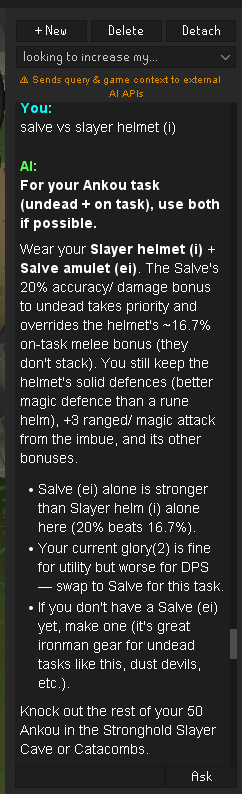
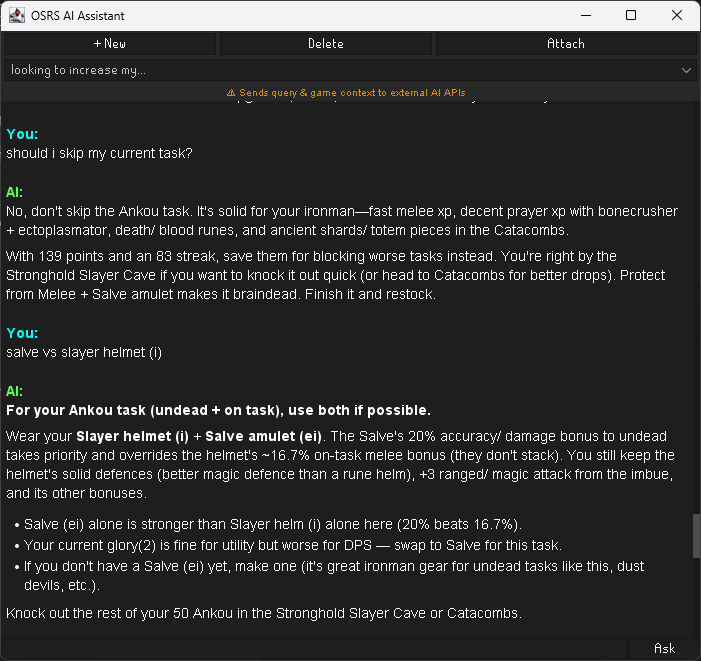
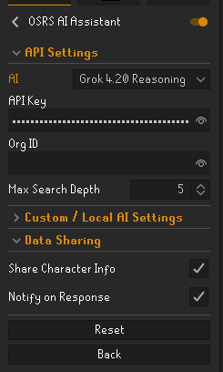

<h1 align="center">OSRS AI Assistant</h1>

<p align="center">
  <strong>An intelligent, context-aware AI companion plugin for RuneLite</strong>
</p>

<p align="center">
  
  
  
  
</p>

---

**OSRS AI Assistant** is a RuneLite plugin that brings state-of-the-art AI language models directly into your Old School RuneScape client. Designed as a real-time, context-aware in-game companion, it autonomously inspects your character's stats, gear, quests, slayer tasks, bank, and active location to provide accurate strategy, gearing advice, skilling guides, PvM tactics, and quest help.

> [!NOTE]
> Powered by an autonomous function-calling system, the AI dynamically inspects live player state and searches the **OSRS Wiki** in real time to guarantee answers stay grounded in current game mechanics.

---

## ✨ Features

- **🎮 Autonomous Game Context Integration:**
  - Automatically analyzes player base & boosted skill levels, XP, run energy, prayer points, active prayers, and combat vitals.
  - Detects current location, Wilderness level, multi-combat zones, instanced areas, and world types (PvP, High Risk, Members).
  - Inspects active inventory, equipped items, and bank contents (when open) with live GE and High Alchemy prices.
- **🛡️ Account-Type Awareness:**
  - Full support for Main, Ironman, Ultimate Ironman (UIM), Hardcore Ironman (HCIM), Group Ironman (GIM), Hardcore GIM, and Unranked GIM accounts.
  - Automatically tailors advice based on account restrictions (e.g. prioritizing High Alchemy values over GE prices and avoiding invalid trading suggestions for Ironmen).
- **🧠 Multi-Model AI Support:**
  - **xAI Grok 4.20 Reasoning** (Default)
  - **xAI Grok 4.3**
  - **Google Gemini 2.5 Flash**
  - **OpenAI GPT-4o**
  - **Anthropic Claude 3.5 Sonnet**
  - **Custom / Local AI** (Connect to Ollama, LM Studio, LocalAI, vLLM, or any OpenAI-compatible API endpoint).
- **🗂️ Multi-Session & Window Flexibility:**
  - Create, switch, and delete multiple chat sessions with persistent local history.
  - Usable as a standard RuneLite sidebar panel or detached as an independent floating window (remembers position and dimensions).
- **🔔 Audio & OS Notifications:**
  - Optional RuneScape-themed sound effects and desktop/client notifications when AI answers finish generating.

---

## 🛠️ Exposed AI Tools (Function Calling)

The AI assistant is granted access to a suite of **14 custom tools** enabling it to query live game state and verify wiki data before generating answers:

### 📊 Player State & Inventory Tools
- `get_player_skills` — Retrieves base levels, boosted levels, XP, and level-up progress. Supports filtering by specific skill (e.g. Attack, Slayer).
- `get_player_inventory` — Retrieves items, quantities, Grand Exchange market prices, and High Alchemy values currently in inventory.
- `get_player_equipment` — Retrieves equipped gear, quantities, GE prices, and High Alchemy values across all equipment slots.
- `get_player_bank` — Retrieves bank items, quantities, GE prices, and High Alchemy values when the bank interface is open. Supports item name search filtering and minimum value thresholds.
- `get_player_status` — Retrieves real-time combat status (current HP, Prayer points, active prayer icons, poison/venom state, run energy, special attack %).
- `get_player_currencies_and_points` — Retrieves minigame currencies, tokens, and reward points (e.g. NMZ points, Pest Control commendations, Tithe Farm points, Golden Nuggets, Abyssal Pearls, Marks of Grace, Slayer points, Archery tickets).
- `get_player_location_details` — Retrieves location attributes including Wilderness level, multi-combat status, instanced area check, world types, and region ID.

### 📜 Progression & Activities Tools
- `get_player_slayer_task` — Retrieves current Slayer task assignment, target monster, remaining kill count, Slayer points, and task streak.
- `get_player_quests` — Retrieves total quest points, completed quest count, and status lists (`IN_PROGRESS`, `NOT_STARTED`, `COMPLETED`, `ALL`).
- `get_player_achievement_diaries` — Retrieves Achievement Diary completion progress for all 12 regions across Easy, Medium, Hard, and Elite tiers.
- `get_player_combat_achievements` — Retrieves Combat Achievement tier progress (Easy through Grandmaster), boss/monster kill counts (KC), and task completion. Supports filtering by tier, boss name, completion status, or task name.
- `get_player_clues` — Retrieves active clue scroll details (current step text, requirements, solution) and clue scroll items in inventory or bank.

### 📚 Knowledge & Item Intelligence Tools
- `get_item_stats` — Retrieves equipment stats, combat bonuses, weight, slot type, and market prices for specified item names or IDs.
- `search_osrs_wiki` — Performs a live search on the Old School RuneScape Wiki for authoritative game mechanics, boss guides, drop tables, quest requirements, training methods, and recent game updates.

---

## ⚙️ Configuration

Open **RuneLite Settings (wrench icon)**, search for **OSRS AI Assistant**, then configure:

| Section | Setting | Description |
| :--- | :--- | :--- |
| **API Settings** | **AI** | Select provider: Grok 4.20 Reasoning, Grok 4.3, Gemini 2.5 Flash, GPT-4o, Claude 3.5, or Custom. |
| **API Settings** | **API Key** | Secret API key for your selected provider. |
| **API Settings** | **Org ID** | Optional organization ID (if required by your provider). |
| **API Settings** | **Max Search Depth** | Maximum recursive tool calls/wiki searches the AI can execute per query (1–10, default 5). |
| **Custom / Local AI** | **Custom Endpoint** | API URL for custom/local OpenAI-compatible server (e.g., `http://localhost:11434/v1/chat/completions`). |
| **Custom / Local AI** | **Custom Model ID** | Override model ID (e.g. `llama3`, `mistral`, or local model name). |
| **Data Sharing** | **Share Character Info** | Toggle sharing player stats, location, gear, quests, and bank data with the AI provider. |
| **Data Sharing** | **Notify on Response** | Toggle sound effect and notification when an AI response completes. |

---

## 🎨 UI Preview

<div align="center">

| 💬 Sidebar Panel | 🪟 Detached Window | ⚙️ Plugin Settings |
| :---: | :---: | :---: |
| [](assets/ui_preview.png) | [](assets/detached_preview.png) | [](assets/settings_preview.png) |

</div>

---

## 🚀 Installation

### For Players

Installation is supported via the **RuneLite Plugin Hub** only.

- **Plugin Hub listing: TBA**
---

## 🧪 Development

If you’re contributing or running locally for development:

1. Clone this repository:
   ```bash
   git clone https://github.com/Timboy67678/osrs-ai-assistant.git
   cd osrs-ai-assistant
   ```
2. Run the plugin in developer mode:
   ```bash
   ./gradlew run
   ```
   *(On Windows, use `./gradlew.bat run`)*

---

## 🤖 AI Disclosure & Development Notes

This project was built entirely by **Google Antigravity AI**, an agentic coding assistant developed by the Google DeepMind team. 

- **Primary Developer:** Google Antigravity AI (via autonomous execution loops)
- **Collaboration Model:** Pair programming with @Timboy67678
- **Core Technology:** DeepMind Gemini Models and advanced software agent toolkits

Every component in this repository—including the RuneLite plugin configuration interface, the Swing UI panels, thread management, dynamic OSRS Wiki context resolvers, function-calling tool registries, and the Gradle build configuration—was structured, written, and refactored by the AI assistant. 

---

## 📄 License

This project is licensed under the BSD 2-Clause License - see the [LICENSE](LICENSE) file for details.
